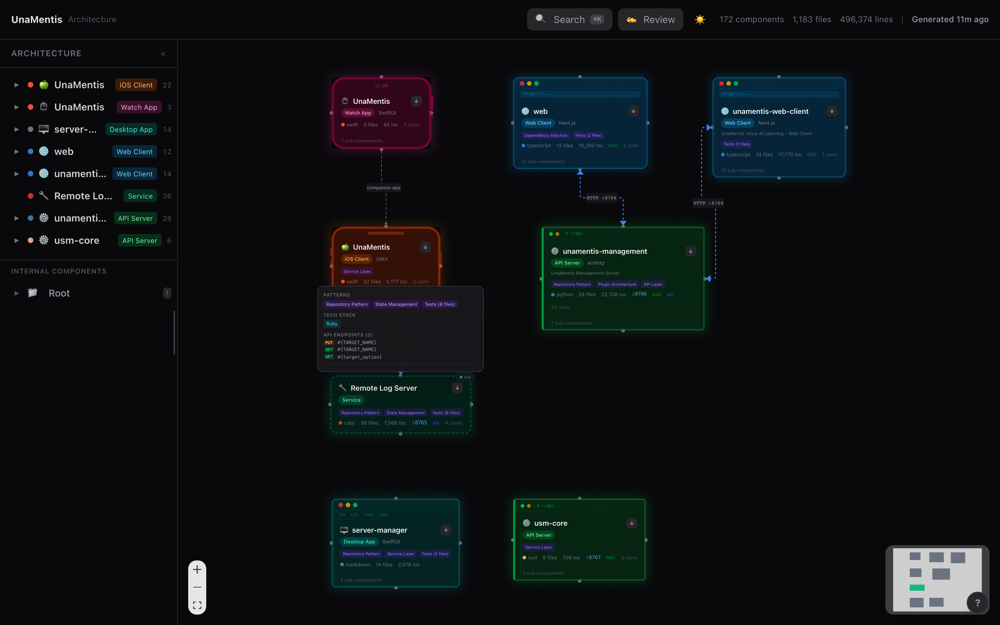
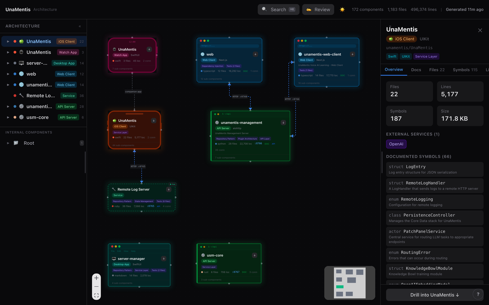
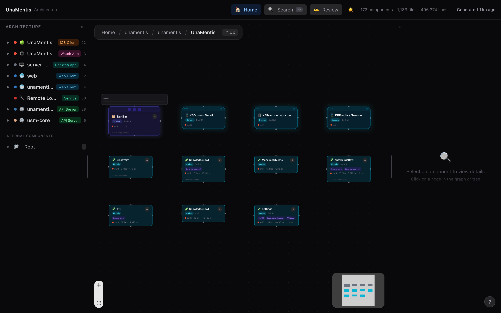

<p align="center">
  
</p>

<h1 align="center">Solution Explorer</h1>

<p align="center">
  <strong>Interactive architecture visualization for any codebase</strong>
</p>

<p align="center">
  <a href="https://github.com/sirfifer/solution-explorer/actions/workflows/architecture-viz.yml"></a>
  <a href="LICENSE"></a>
  <a href="https://github.com/sirfifer/solution-explorer/releases"></a>
  
  
</p>

<p align="center">
  <a href="#quick-start">Quick Start</a> &middot;
  <a href="#screenshots">Screenshots</a> &middot;
  <a href="#how-it-works">How It Works</a> &middot;
  <a href="#deployment-options">Deploy</a> &middot;
  <a href="CONTRIBUTING.md">Contributing</a>
</p>

---

Solution Explorer is a static analysis tool that scans codebases to extract components, relationships, and metrics, then renders them as an interactive architecture diagram. It supports solutions that span multiple repositories and works with many languages.

## Screenshots

### Architecture Overview

The main graph view shows all components in your codebase as interactive cards. Each card displays the component type, framework, language, file count, and key metrics. Arrows between components indicate relationships like imports, HTTP connections, and Docker links.

<p align="center">
  
</p>

### Component Detail Panel

Click any component to open the detail panel on the right. It shows files, lines of code, symbols, documented symbols with descriptions, external services, tech stack tags, and a button to drill deeper into the component's internals.

<p align="center">
  
</p>

### Drill-Down View

Double-click a component to drill into it and see its internal structure. Breadcrumbs at the top let you navigate back. Each sub-component is rendered as its own card, showing the hierarchical architecture of your codebase.

<p align="center">
  
</p>

## Quick Start

### Using the GitHub Action (recommended)

Add this workflow to your repo at `.github/workflows/architecture.yml`:

```yaml
name: Architecture Visualization
on:
  push:
    branches: [main]

permissions:
  contents: read

jobs:
  visualize:
    runs-on: ubuntu-latest
    steps:
      - uses: actions/checkout@v4
      - uses: sirfifer/solution-explorer@v1
```

This analyzes your repo and uploads the visualization as a downloadable artifact. To deploy it automatically, see [Deployment Options](#deployment-options) below.

### Running Locally

```bash
# 1. Clone solution-explorer
git clone https://github.com/sirfifer/solution-explorer.git
cd solution-explorer

# 2. Analyze your project
python3 analyze.py /path/to/your/repo -o viewer/public/architecture.json

# 3. Start the viewer
cd viewer && npm install && npm run dev
```

Or use the build script to produce a deployable static site:

```bash
bash build.sh /path/to/your/repo
# Output: viewer/dist/ (deploy anywhere)
```

### Requirements

- **Python 3.10+**
- **Node.js 18+** (for the viewer)

## How It Works

```
┌─────────────────┐     ┌──────────────────┐     ┌─────────────────────┐
│  Your Codebase  │────>│  analyzer/        │────>│  architecture.json  │
│                 │     │  (Python)         │     │                     │
└─────────────────┘     └──────────────────┘     └──────────┬──────────┘
                                                            │
                                                            v
                                                 ┌─────────────────────┐
                                                 │  React Viewer       │
                                                 │  (interactive graph)│
                                                 └─────────────────────┘
```

1. **Python Analyzer** (`analyzer/` package) walks the codebase
2. Detects components via marker files (package.json, Cargo.toml, Info.plist, Dockerfile, etc.)
3. Parses source files to extract symbols, imports, and API patterns
4. Detects inter-component relationships (imports, HTTP/port references, protocols)
5. Outputs `architecture.json` with the full hierarchical model
6. **React Viewer** renders the data as an interactive graph using React Flow and ELK layout

### Supported Languages

| Tier | Languages | What's Extracted |
|------|-----------|-----------------|
| **Full parsing** | Swift, Python, Rust, TypeScript/JavaScript, Go | Components, symbols, relationships, frameworks, API endpoints |
| **Detection + metrics** | Java, Kotlin, Ruby, C/C++, C#, Dart, Vue, Svelte, HTML/CSS, SQL, Shell | File counts, line counts, size, language breakdown |

### What It Detects

| Category | Details |
|----------|---------|
| **Components** | Via marker files: package.json, Cargo.toml, pyproject.toml, go.mod, Info.plist, Dockerfile, and more |
| **Symbols** | Classes, structs, enums, protocols/traits/interfaces, functions, React components |
| **Relationships** | Import dependencies, port-based HTTP connections, Docker Compose links, URL patterns |
| **Metrics** | File counts, line counts, size, language breakdown per component |
| **Frameworks** | SwiftUI, UIKit, React, Next.js, Flask, Django, Axum, Express, Vue, and more |
| **Documentation** | README, CLAUDE.md, CHANGELOG, API endpoints, env vars, architectural patterns |
| **Cloud Services** | AWS, Firebase, Supabase, and other external service references |

## Viewer Features

- **Hierarchical drill-down**: Click to see details, double-click to drill into sub-components
- **Breadcrumb navigation**: Always know where you are, click to jump back
- **Fuzzy search**: Cmd/Ctrl+K to search across components, files, and symbols
- **Code preview**: Inline syntax-highlighted code for every symbol
- **Relationship visualization**: Arrows show dependencies and HTTP connections
- **Tree sidebar**: Collapsible component tree for quick navigation
- **Dark/light mode**: Toggle with one click
- **Mobile-friendly**: Touch gestures, bottom sheet panels, responsive layout
- **Multi-repo grouping**: Repository-level nodes when visualizing multi-repo solutions
- **Onboarding tour**: Guided walkthrough for first-time users

### Keyboard Shortcuts

| Key | Action |
|-----|--------|
| Cmd/Ctrl + K | Open search |
| Escape | Close search/panels |
| Arrow keys | Navigate search results |
| Enter | Select search result |

## Multi-Repo Solutions

For solutions that span multiple repositories, create a `solution-explorer.json` config file:

```json
{
  "solution": "My Platform",
  "description": "Backend services and mobile client",
  "repositories": [
    { "name": "backend", "path": "." },
    {
      "name": "android-client",
      "url": "https://github.com/your-org/android-client",
      "ref": "main"
    }
  ],
  "cross_repo_relationships": [
    {
      "source_repo": "android-client",
      "target_repo": "backend",
      "type": "http",
      "label": "REST API"
    }
  ]
}
```

See [solution-explorer.json.example](solution-explorer.json.example) for a complete template.

### Config Reference

**repositories** (required): List of repos to analyze.
- `name`: Display name for the repository
- `path`: Local filesystem path (relative to the config file). Use `"."` for the current repo.
- `url`: Git URL to clone (alternative to `path`). Supports HTTPS URLs.
- `ref`: Branch or tag to clone (default: HEAD)

For private repos, set the `GITHUB_TOKEN` environment variable.

**cross_repo_relationships** (optional): Explicit connections between repos that the analyzer cannot detect automatically (since repos are analyzed independently).
- `source_repo` / `target_repo`: Repository names from the `repositories` list
- `type`: Relationship type (`http`, `grpc`, `websocket`, `import`, `database`)
- `label`: Human-readable description

### Multi-Repo with the GitHub Action

```yaml
- uses: sirfifer/solution-explorer@v1
  with:
    config: solution-explorer.json
    github-token: ${{ secrets.GITHUB_TOKEN }}
```

### Multi-Repo Locally

```bash
python3 analyze.py --config solution-explorer.json -o viewer/public/architecture.json
cd viewer && npm install && npm run dev
```

## Deployment Options

The viewer builds to a static site (`viewer/dist/`). Deploy it to any static host.

### Cloudflare Pages

Using the GitHub Action:

```yaml
- uses: sirfifer/solution-explorer@v1
  with:
    deploy-to: cloudflare
    cloudflare-api-token: ${{ secrets.CLOUDFLARE_API_TOKEN }}
    cloudflare-account-id: ${{ secrets.CLOUDFLARE_ACCOUNT_ID }}
    cloudflare-project-name: my-architecture
```

**Setup:**
1. In the Cloudflare dashboard, go to Workers & Pages and create a new Pages project
2. Choose "Direct Upload" (the Action handles the upload)
3. Create an API token at Account > API Tokens with the "Cloudflare Pages: Edit" permission
4. Add `CLOUDFLARE_API_TOKEN` and `CLOUDFLARE_ACCOUNT_ID` as repository secrets
5. Optionally set `CLOUDFLARE_PROJECT_NAME` as a repository variable

To use a custom domain, add it in the Cloudflare Pages project settings under "Custom domains."

Using Cloudflare's git integration directly:
- **Build command**: `bash build.sh`
- **Build output directory**: `viewer/dist`
- **Environment variables**: `NODE_VERSION=22`, `PYTHON_VERSION=3.12`

### GitHub Pages

```yaml
- uses: sirfifer/solution-explorer@v1
  with:
    deploy-to: github-pages
```

Then add a separate deploy job:

```yaml
deploy:
  needs: visualize
  runs-on: ubuntu-latest
  permissions:
    pages: write
    id-token: write
  environment:
    name: github-pages
  steps:
    - uses: actions/deploy-pages@v4
```

### Vercel / Netlify

Point your project at the repo with:
- **Build command**: `bash build.sh`
- **Output directory**: `viewer/dist`

### Self-Hosted / S3

Run `bash build.sh` and copy `viewer/dist/` to your server or bucket.

## GitHub Action Reference

```yaml
- uses: sirfifer/solution-explorer@v1
  with:
    # Single-repo: path to analyze (default: ".")
    path: '.'

    # Multi-repo: path to config file
    config: 'solution-explorer.json'

    # Where to deploy: cloudflare, github-pages, or artifact-only (default)
    deploy-to: 'artifact-only'

    # Cloudflare settings (required when deploy-to is cloudflare)
    cloudflare-api-token: ''
    cloudflare-account-id: ''
    cloudflare-project-name: 'solution-explorer'

    # For cloning private repos in multi-repo mode
    github-token: ''
```

## CLI Options

```
python3 analyze.py [path] [options]

Options:
  -o, --output        Output path (default: architecture.json)
  --config            Path to solution-explorer.json for multi-repo mode
  --split             Output split files for lazy loading (manifest.json + per-component detail files)
  --max-file-size     Skip files larger than N bytes (default: 500KB)
  --max-symbols       Limit symbols in output (default: 5000 in single-file mode, unlimited in split mode; 0=unlimited)
  --preview-lines     Lines per code preview (default: 5)
  --compact           Compact JSON (no indentation)
```

## Architecture Data Format

<details>
<summary>Click to expand the full schema</summary>

```json
{
  "name": "string",
  "description": "string",
  "repository": "string",
  "generated_at": "ISO 8601 timestamp",
  "repositories": [
    { "name": "string", "repository": "string" }
  ],
  "components": [
    {
      "id": "string",
      "name": "string",
      "type": "ios_app | web_client | api_server | service | library | ...",
      "path": "string",
      "language": "string",
      "framework": "string",
      "port": "number | null",
      "children": ["... nested components"],
      "files": ["... file paths"],
      "metrics": {
        "files": "number",
        "lines": "number",
        "size_bytes": "number",
        "symbols": "number",
        "languages": { "lang": "number of files" }
      },
      "docs": {
        "readme": "string | null",
        "purpose": "string | null",
        "patterns": ["string"],
        "tech_stack": ["string"],
        "api_endpoints": ["string"],
        "env_vars": ["string"]
      }
    }
  ],
  "relationships": [
    {
      "source": "component_id",
      "target": "component_id",
      "type": "import | http | docker | grpc | websocket",
      "label": "string",
      "protocol": "string | null",
      "port": "number | null"
    }
  ],
  "symbols": [
    {
      "id": "string",
      "name": "string",
      "kind": "class | struct | enum | protocol | function | component",
      "file": "string",
      "line": "number",
      "end_line": "number",
      "code_preview": "string",
      "visibility": "public | internal | private"
    }
  ],
  "files": [
    {
      "path": "string",
      "language": "string",
      "lines": "number",
      "size_bytes": "number",
      "symbols": "number",
      "imports": ["string"]
    }
  ],
  "stats": {
    "total_files": "number",
    "total_lines": "number",
    "total_symbols": "number"
  }
}
```

</details>

### Split Mode Output

When using `--split`, the analyzer produces a directory instead of a single file:

```
architecture/
├── manifest.json                    # Component tree, relationships, stats (~20-100 KB)
└── data/
    ├── detail-component-a.json      # Symbols and files for component A
    ├── detail-component-b.json      # Symbols and files for component B
    └── ...
```

The manifest contains everything needed to render the graph: component hierarchy, relationships, metrics, and AI enhancements. Symbols and files are loaded on demand when a user opens a component's detail panel.

The viewer automatically detects split mode (tries `manifest.json` first, falls back to `architecture.json`).

## Local Development

For contributing to solution-explorer itself:

```bash
git clone https://github.com/sirfifer/solution-explorer.git
cd solution-explorer

# Run Python tests
python3 -m pytest tests/ -v

# Analyze this repo as a test
python3 analyze.py . -o viewer/public/architecture.json

# Start the viewer in dev mode
cd viewer && npm install && npm run dev

# Run TypeScript tests and linting
npm test
npm run lint
```

> **Note:** `analyze.py` is a thin wrapper around the `analyzer/` package. Both `python3 analyze.py` and `python3 -m analyzer` work identically.

See [CONTRIBUTING.md](CONTRIBUTING.md) for the full development guide.

## Project Structure

```
solution-explorer/
├── analyze.py              # CLI entry point (thin wrapper)
├── analyzer/               # Core analysis package
│   ├── __init__.py
│   ├── cli.py              # Argument parsing, split/single-file output
│   ├── models.py           # Dataclasses: Component, Symbol, Relationship, etc.
│   ├── scanner.py          # ArchitectureScanner (component discovery, metrics, docs)
│   ├── swiftui_flow.py     # SwiftUI navigation/tab flow detection
│   ├── multi_repo.py       # Multi-repo orchestration
│   ├── config_parsers.py   # Config file parsers (package.json, Cargo.toml, etc.)
│   ├── constants.py        # Skip dirs, language maps, component markers
│   ├── utils.py            # Shared helpers
│   └── parsers/            # Per-language source parsers
│       ├── __init__.py     # Parser registry
│       ├── base.py         # BaseParser interface
│       ├── swift.py        # Swift/SwiftUI
│       ├── python_lang.py  # Python
│       ├── typescript.py   # TypeScript/JavaScript/React
│       ├── go.py           # Go
│       ├── rust.py         # Rust
│       └── ruby.py         # Ruby
├── tests/                  # Python test suite (370 tests, 81% coverage)
├── action.yml              # GitHub Action definition
├── build.sh                # Static site build script
└── viewer/                 # React/TypeScript frontend
    ├── src/
    │   ├── components/     # React components (nodes, panels, search, tour)
    │   ├── utils/          # Layout engine, search, documentation
    │   ├── store.ts        # Zustand state management (with lazy loading)
    │   └── types.ts        # TypeScript type definitions
    ├── vite.config.ts      # Build configuration
    └── vitest.config.ts    # Test configuration
```

## Contributing

Contributions are welcome! Please read [CONTRIBUTING.md](CONTRIBUTING.md) for details on:

- Setting up the development environment
- Running tests and linters
- Submitting pull requests
- Adding language support

## License

[MIT](LICENSE) &copy; 2025-2026 sirfifer
