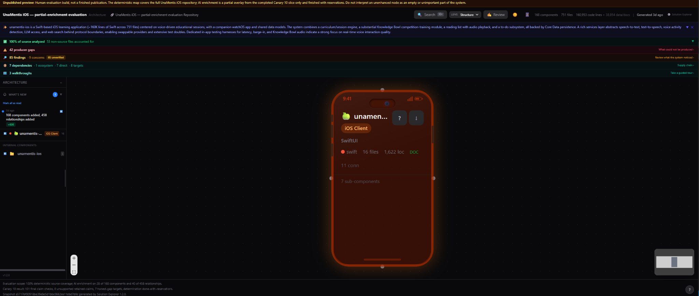
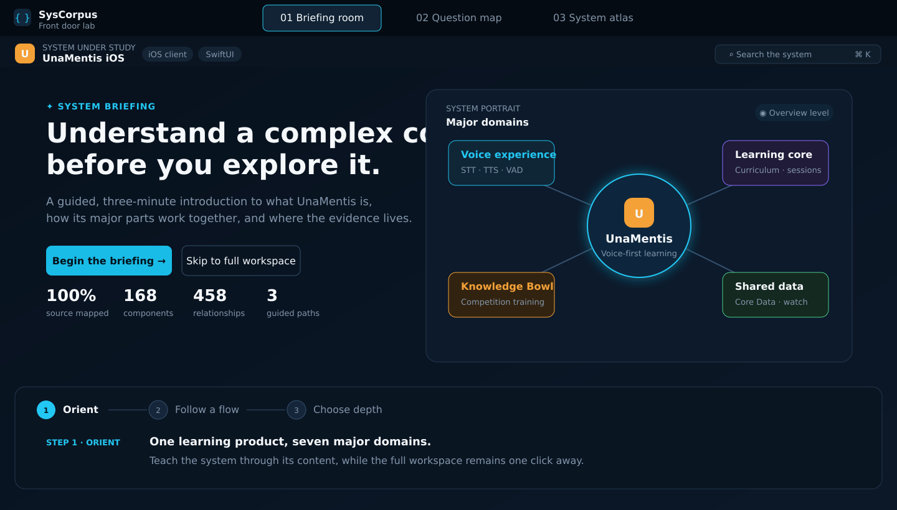
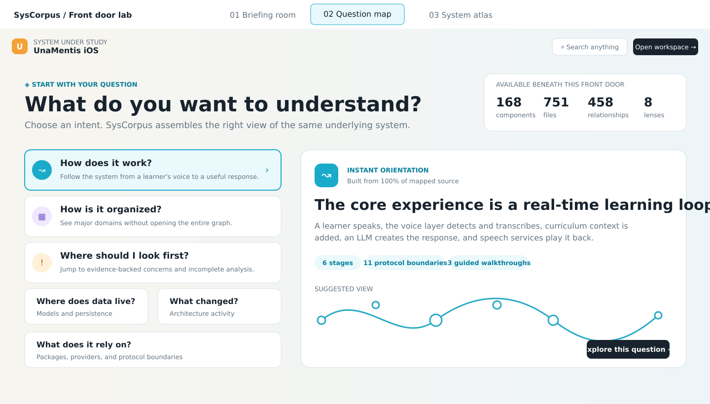
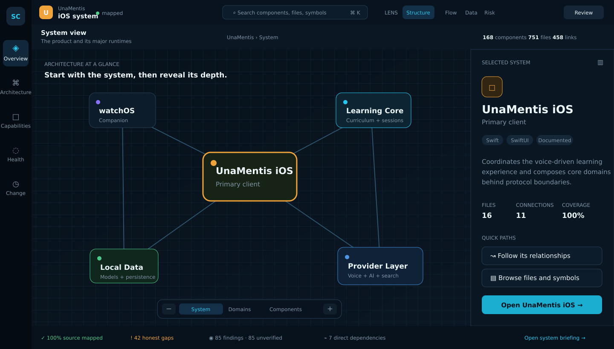

# SysCorpus Front Door Design Report

**Status:** Historical research and design record
**Example system:** UnaMentis iOS
**Primary audience:** AI agents implementing or evaluating the design
**Secondary audience:** Product, design, engineering, and technical stakeholders
**Interactive prototype:** [SysCorpus Front Door Lab](https://syscorpus-frontdoor-lab.richard-amer-0011.chatgpt.site)
**Existing demo reviewed:** [UnaMentis iOS SysCorpus demo](https://main.unamentis-ios-demo.pages.dev/)

> This report preserves the research and interface concepts that informed the
> comprehension-first viewer. The implemented viewer and its tests are now
> authoritative; this document is not a parallel product specification. The
> current-demo image is an actual supplied screenshot, and the concept images
> are source-faithful interface maps based on the prototype structure and copy.

---

## 1. Executive recommendation

SysCorpus should have two distinct layers:

1. **A front door that establishes comprehension**
2. **A full workspace that supports investigation**

The current demo is already a capable technical workspace. Its problem is not missing data or functionality. Its problem is that almost all of that capability competes for attention at once.

The recommended product direction combines the three prototypes:

- Use the **Briefing Room** as the default first encounter.
- Add the **Question Map** as the fastest route for visitors who already know what they want to understand.
- Use the **System Atlas** as the primary exploratory workspace and the destination for deeper analysis.
- Keep an always-visible **Skip to full workspace** action for experts.
- Carry the visitor's system, object, lens, question, filters, and semantic level forward between layers.

The goal is not to remove complexity. It is to control when each layer of complexity becomes visible.

~~~mermaid
flowchart TD
    A["System front door"] --> B{"How does the visitor want to begin?"}
    B --> C["Briefing Room: build a mental model"]
    B --> D["Question Map: start from intent"]
    B --> E["System Atlas: enter directly"]
    C --> F["Focused system view"]
    D --> F
    F --> E
    E --> G["Files, symbols, evidence, review"]
~~~

---

## 2. Evidence base

The report is based on:

- The supplied screenshot of the current SysCorpus interface.
- Direct inspection of the live demo's navigation, onboarding, graph, inspector, and status surfaces.
- The exact source and content model of the Front Door Lab.
- Real scale indicators used in the prototype.

| Measure | Prototype value |
|---|---:|
| Components | 168 |
| Files | 751 |
| Relationships | 458 |
| Code lines | 160,953 |
| Source mapped | 100% |
| Findings | 85 |
| Producer gaps | 42 |
| Direct dependencies | 7 |
| Guided walkthroughs | 3 |
| AI-enriched components | 28 of 168 |

These figures demonstrate that a front door can acknowledge a substantial body of information without rendering all of it at once.

---

## 3. Current interface findings

### Actual supplied screenshot

### Current opening-screen anatomy

~~~mermaid
flowchart TD
    A["Global navigation, search, lenses, review, metrics"] --> B["Large AI-generated system summary"]
    B --> C["Five stacked analysis and status bands"]
    C --> D["Three-part workspace"]
    D --> E["Left tree and activity"]
    D --> F["Central architecture canvas"]
    D --> G["Inspector when an object is selected"]
    D --> H["Minimap, zoom, help, and footer status"]
~~~

### What is already strong

- The workspace communicates serious analytical depth.
- Search, lenses, graph navigation, inspector tabs, and review tools support several investigative paths.
- Source coverage, partial AI enrichment, producer gaps, and unverified findings are exposed honestly.
- The graph expands into details rather than forcing everything into a static report.
- The inspector connects objects to files, symbols, links, documentation, and evidence.
- The product already contains enough information for newcomer orientation, expert investigation, and audit workflows.

### Main first-arrival problems

1. **Every region asks for attention immediately.**
   Header controls, metrics, summary, status bands, tree, canvas, minimap, footer, and help all appear before the visitor has a stable mental model.

2. **The interface is explained before the system.**
   Onboarding teaches graph interaction, the detail panel, and search. A first-time visitor still needs to understand what UnaMentis is, what its major parts are, and why the map matters.

3. **Visual hierarchy does not match reasoning hierarchy.**
   Coverage, gaps, findings, dependencies, and walkthroughs receive similar horizontal treatment even though they answer different questions.

4. **The central canvas initially has low explanatory yield.**
   One large root object occupies the focal area while most system meaning remains collapsed.

5. **Visible chrome implies work before value.**
   A casual visitor sees many actions but no obvious first useful question.

6. **Breadth is visible, but structure is not legible.**
   The interface clearly contains a lot. It does not immediately explain how the categories fit together.

7. **Partial enrichment can be misread.**
   Transparency is good, but status interpretation should not be part of the initial cognitive burden.

8. **Expert and newcomer needs are mixed rather than layered.**
   Experts need immediate access. New visitors need orientation. Both can be served without giving both audiences the entire workspace as their first screen.

### Core diagnosis

The current experience has a **sequencing problem**, not an information problem.

Recommended response:

- Keep the mature workspace.
- Put a comprehension layer in front of it.
- Make depth visible as a promise.
- Reveal operational complexity after the visitor chooses a direction.

---

## 4. Design principles

### 4.1 Orientation before operation

The first screen should answer:

- What system is this?
- What does it do?
- What are its major parts?
- How much information is available?
- What are the useful ways to begin?

It should not begin by teaching zoom controls, inspector mechanics, or every lens.

### 4.2 Visible depth, controlled exposure

Do not produce a sparse page that hides all evidence of complexity. Show credible scale indicators, representative domains, available analytical paths, and direct routes into detail.

The desired first impression is:

> I understand what this is, I can see that it is deep, and I know where to start.

### 4.3 Progressive disclosure by meaning

| Level | Visitor sees | Purpose |
|---|---|---|
| 0. Identity | Name, type, snapshot, concise description | Establish scope |
| 1. Portrait | Major products, runtimes, or domains | Build the mental model |
| 2. Intent | Questions, briefing steps, or guided paths | Choose a reason to explore |
| 3. Focused view | Relevant flow, domain, risk cluster, or data path | Deliver the first useful answer |
| 4. Workspace | Graph, lenses, navigation, status, inspector | Support investigation |
| 5. Evidence | Files, symbols, findings, provenance, review | Verify details |

### 4.4 Teach through real content

Guidance should use the actual project:

- "One learning product, seven major domains."
- "A conversation crosses six replaceable stages."
- "All analyzable source is mapped; interpretation is deliberately partial."

This is more useful than generic coaching such as "Click a node to see details."

### 4.5 Intent before taxonomy

| Visitor question | SysCorpus view |
|---|---|
| How does it work? | Flow and runtime relationships |
| How is it organized? | Structure and major domains |
| Where should I look first? | Findings, concerns, and gaps |
| Where does data live? | Data models and persistence |
| What changed? | Activity and architecture change |
| What does it rely on? | Dependencies and provider boundaries |

### 4.6 One region, one responsibility

- Navigation chooses the area.
- Canvas explains relationships.
- Inspector explains one selected object.
- Status strip summarizes evidence state.
- Search retrieves objects.
- Briefing explains the product.

### 4.7 Preserve context

If a visitor starts with "How does it work?" and opens the workspace:

- Flow should already be active.
- The relevant walkthrough should be selected.
- The graph should open at the correct semantic level.
- The inspector should show the object under discussion.
- The transition must not feel like starting over.

### 4.8 Keep complexity honest

The front door may summarize. It must not:

- Turn unverified findings into conclusions.
- Hide analysis gaps.
- Imply that un-enriched components are empty or unimportant.
- Present AI prose as deterministic evidence.
- Confuse repository boundaries with architectural importance.

---

## 5. Concept 01: Briefing Room

### Source-faithful interface map

### Purpose

A narrative front door for visitors who need comprehension before exploration.

It guides the visitor through three steps:

1. Orient to the product and its major domains.
2. Follow a core system flow.
3. Choose the appropriate depth and destination.

### First-screen hierarchy

1. System identity and snapshot.
2. One-sentence value proposition.
3. Concise experience explanation.
4. Primary action: begin the briefing.
5. Expert escape hatch: skip to full workspace.
6. Four scale indicators.
7. System portrait with representative domains.
8. Visible three-step path.

~~~mermaid
stateDiagram-v2
    [*] --> Orient
    Orient --> CoreFlow: Continue
    CoreFlow --> ChooseDepth: Continue
    ChooseDepth --> FocusedView: Select a path
    Orient --> Workspace: Skip
    CoreFlow --> Workspace: Skip
    ChooseDepth --> Workspace: Full map
~~~

### Strengths

- Strongest mental model for casual and first-time visitors.
- Demonstrates depth without exposing the entire interface.
- Uses project information instead of generic onboarding.
- Works well when the system has a clear product story or core flow.
- Provides a natural place to explain coverage and enrichment limits.
- Preserves expert speed through the skip action.

### Risks

- It must not become a mandatory modal tour.
- Generated narrative requires traceable evidence.
- A long briefing becomes documentation rather than a front door.
- Systems without one clear story may need several selectable briefings.

### Repository behavior

- **Single repository:** Center the portrait on the product or runtime. Show four to seven major capabilities.
- **Multi-repository:** Center the overall system. Place clients, services, data platforms, and shared components around it. Allow equal peers when the architecture requires them.

### Recommended role

Default first encounter for new or casual visitors.

---

## 6. Concept 02: Question Map

### Source-faithful interface map

### Purpose

The Question Map removes the requirement to learn SysCorpus terminology before receiving value. Ordinary-language intent produces an immediate project-specific orientation.

### Starting questions

- How does it work?
- How is it organized?
- Where should I look first?
- Where does data live?
- What changed?
- What does it rely on?

Each answer contains:

- A direct headline.
- A concise project-specific explanation.
- Three supporting facts.
- A small suggested view.
- A path into a focused workspace.

~~~mermaid
flowchart TD
    A["Choose an ordinary-language question"] --> B["Receive a project-specific answer"]
    B --> C["See supporting facts and a miniature view"]
    C --> D["Explore the focused lens"]
    D --> E["Expand to graph, files, symbols, or evidence"]
    A --> F["Open complete workspace"]
~~~

### Strengths

- Fastest route to a useful answer for mixed audiences.
- Avoids a feature-centric menu.
- Makes analytical breadth understandable without exposing every lens.
- Scales naturally across single-repository and multi-repository systems.
- Gives generated summaries a clear, constrained job.

### Risks

- The question set becomes a product taxonomy and must be maintained.
- Similar questions can overlap unless each has a distinct result.
- Generated answers must expose evidence and confidence.
- Too many questions recreate the clutter being removed.

### Repository behavior

- **Single repository:** Questions open internal flows, domains, data, change, and risk.
- **Multi-repository:** Questions operate across the overall system. Repository selection is a refinement, not the opening decision.

### Recommended role

Primary alternative entry route and best first action for visitors with a specific goal.

---

## 7. Concept 03: System Atlas

### Source-faithful interface map

### Purpose

An aggregated visual front door for technical visitors who expect to manipulate architecture immediately.

It preserves the graph-centered nature of SysCorpus but changes initial granularity.

### Semantic zoom

| Level | Shows | Example |
|---|---|---|
| System | Products and major runtimes | iOS, watchOS, learning core, provider layer, local data |
| Domains | Functional areas | Session engine, curriculum, voice, Knowledge Bowl, persistence |
| Components | Implementation units | SessionCoordinator, LLMProvider, SessionStore |

Semantic zoom changes the **meaning level**, not merely the physical size of nodes.

### Screen responsibilities

- Left rail: major analysis areas.
- Top bar: search, lenses, and review.
- Context bar: semantic level, breadcrumb, and compact measures.
- Canvas: relationships at the current meaning level.
- Inspector: selected-object context and actions.
- Status bar: coverage, gaps, findings, and dependencies.

~~~mermaid
stateDiagram-v2
    [*] --> System
    System --> Domains: Zoom in
    Domains --> Components: Zoom in
    Components --> Domains: Zoom out
    Domains --> System: Zoom out
    System --> Inspector: Select object
    Domains --> Inspector: Select domain
    Components --> Inspector: Select component
    Inspector --> Evidence: Open detail
~~~

### Strengths

- Preserves technical credibility.
- Shows depth without rendering all 168 components.
- Supports direct manipulation and expert exploration.
- Provides a strong multi-repository model.
- Keeps the selected object in context.
- Connects architectural overview to implementation evidence.

### Risks

- Graphs remain intimidating to some visitors.
- Weak clustering would undermine semantic zoom.
- Canvas, inspector, rail, and status can become cluttered if allowed to grow independently.
- Meaningful semantic levels must be part of the data model.

### Repository behavior

- **Single repository:** System level represents runtimes and major boundaries, not one oversized repository node.
- **Multi-repository:** System level shows architectural peers. Repository membership appears as metadata, boundary, color, or filter.

### Recommended role

Primary expert workspace and destination after the Briefing Room or Question Map.

---

## 8. Comparison matrix

| Criterion | Briefing Room | Question Map | System Atlas |
|---|---|---|---|
| Primary audience | New and casual | Mixed with a goal | Technical and expert |
| Immediate comprehension | Excellent | Excellent | Good for technical users |
| Visible depth | Strong | Strong | Very strong |
| Time to useful answer | 1 to 3 minutes | Seconds | Immediate for graph-literate users |
| Expert escape | Required | Required | Native |
| Single-repository fit | Excellent | Excellent | Strong |
| Multi-repository fit | Strong | Excellent | Excellent |
| Cognitive device | Narrative | Intent | Spatial model |
| Main risk | Feels like a tour | Taxonomy grows | Graph crowds |
| Product role | Default front door | Alternative front door | Main workspace |

No single concept should replace the other two. They solve different arrival states.

---

## 9. Recommended combined experience

### Entry screen

Include only elements that help the visitor choose a starting path:

1. **System identity:** name, type, snapshot age, concise scope.
2. **System portrait:** four to seven domains or peer components.
3. **Brief orientation:** what the system does and one key flow.
4. **Question shortcuts:** four to six ordinary-language questions.
5. **Breadth ledger:** components, files, relationships, coverage, available paths.
6. **Two actions:** begin briefing and open workspace.

Do not put the complete header, all analysis bands, full tree, and full graph on this screen.

### Focused view

The first transition should produce value, not another menu:

- "How does it work?" opens the main runtime flow.
- "Where does data live?" opens models, stores, and consuming domains.
- "Where should I look first?" opens a ranked evidence view with verification state.
- Briefing step two opens the core voice-learning flow.

### Full workspace

Inherit:

- Current object or domain.
- Current question.
- Current lens.
- Current semantic zoom.
- Current walkthrough step.
- Current filters.

Allow a return to the front door without losing workspace state.

~~~mermaid
flowchart LR
    A["Front door"] --> B["Focused answer"]
    B --> C["System Atlas"]
    C --> D["Evidence detail"]
    D --> C
    C --> B
    B --> A
~~~

---

## 10. Information architecture

~~~mermaid
flowchart TD
    A["System"] --> B["Overview"]
    A --> C["Architecture"]
    A --> D["Capabilities"]
    A --> E["Health and evidence"]
    A --> F["Change"]
    C --> G["System level"]
    C --> H["Domain level"]
    C --> I["Component level"]
    E --> J["Findings"]
    E --> K["Gaps"]
    E --> L["Verification"]
~~~

### Global navigation

- Overview
- Architecture
- Capabilities
- Health
- Change

Search and Review remain global actions.

### Lenses

- Structure
- Flow
- Data
- Risk

Add another lens only when it produces a meaningfully different representation.

### Inspector

Begin with:

- Object identity and role.
- Concise explanation.
- Source and confidence state.
- Four or fewer high-value metrics.
- Three quick paths.
- One clear drill-in action.

Documentation, files, symbols, and links remain available after the summary.

---

## 11. Single-repository and multi-repository rules

| Design question | Single repository | Multi-repository |
|---|---|---|
| Root object | Product or runtime | Overall system |
| First visual level | Major domains and runtimes | Peer clients, services, data systems, platforms |
| Repository identity | Supporting metadata | Boundary or filter |
| Briefing subject | Product purpose and core flow | System purpose and cross-component flows |
| Question scope | One codebase | Whole system first |
| Semantic zoom | Domains, then components | System components, domains, implementation |
| Dependencies | Internal and external | Cross-repository plus external |

**Principle:** Repository is an implementation and ownership boundary. It is not always the most useful first architectural concept.

If a system contains a web client, API, worker, and shared data platform, show those architectural roles first. Add repository names as supporting context.

---

## 12. Status, evidence, and trust

| Concept | Meaning | Opening treatment |
|---|---|---|
| Source coverage | Whether deterministic analysis includes available code | Compact trust indicator |
| AI enrichment | Whether descriptive or interpretive output exists | Coverage note, never emptiness |
| Finding | Something noticed by analysis | Evidence-backed item |
| Concern | Finding with possible negative impact | Prioritized review item |
| Unverified | Lead not yet confirmed | Explicit badge and filter |
| Producer gap | Analysis that could not be produced | Honest limitation |
| Dependency | External or cross-boundary reliance | Architecture or supply-chain view |
| Walkthrough | Curated system path | Guided learning feature |

On the front door:

- Show source coverage.
- Show the existence of findings and gaps.
- Explain partial enrichment in one sentence.
- Do not show five separate full-width alert bands.

In the workspace:

- Use one compact status strip.
- Let each status category open a dedicated view.
- Preserve severity, confidence, provenance, and verification state.

---

## 13. Copy and visual rules

### Copy

- Direct, specific, technically honest, and free of generic marketing.
- Teach the system through project facts.
- Keep deterministic facts separate from interpretation.
- Make confidence and evidence paths visible.
- Avoid long unstructured AI summaries.

### Visual hierarchy

- One dominant message per screen.
- Strongest accent belongs to the current action or selection.
- Use whitespace to separate reasoning stages, not to create an empty splash.
- Keep scale measures together.
- Keep warnings separate from primary navigation.

### Graph

- Begin with five to seven meaningful nodes.
- Label relationships when the label changes interpretation.
- Keep the selected node's neighborhood visible.
- Use semantic levels rather than shrinking hundreds of nodes.
- Do not make a repository root the entire initial graph.

### Density

| Surface | Intended density |
|---|---|
| Front door | Low to medium |
| Focused view | Medium |
| Full workspace | High |
| Evidence detail | High with strong structure |

---

## 14. Accessibility and responsive behavior

### Accessibility

- All graph nodes keyboard reachable.
- Semantic zoom has explicit labels.
- Color categories have non-color equivalents.
- Inspector updates announce without excessive verbosity.
- Focus moves predictably into a focused result.
- Motion respects reduced-motion preferences.
- Status and metric text meet contrast requirements.

### Responsive behavior

| Viewport | Behavior |
|---|---|
| Wide desktop | Portrait or graph plus inspector |
| Laptop | Collapsible inspector and reduced top-bar actions |
| Tablet | Portrait above narrative; question cards above preview |
| Mobile | Front door and question map primary; graph becomes a focused list or neighborhood |

Do not compress the entire desktop atlas onto a phone.

---

## 15. What not to build

- An empty splash screen with only search or unexplained dots.
- Mandatory onboarding that explains controls before the system.
- The complete 168-component graph as the initial visual.
- A wall of generated prose.
- Five equal full-width status bands before the system portrait.
- Separate beginner and expert products.
- A repository-first hierarchy when runtimes or capabilities explain the system better.
- A simplified front door that hides all proof of depth.
- Zoom that changes only physical size.

---

## 16. Implementation sequence

### Phase 1: Front-door contract

- Define deterministic system identity and snapshot data.
- Generate the System-level portrait.
- Add the breadth ledger.
- Add the direct workspace escape hatch.
- Preserve state between layers.

### Phase 2: Briefing Room

- Implement three steps.
- Generate orientation copy from traceable facts.
- Add one core flow.
- Add explicit evidence links.

### Phase 3: Question Map

- Start with no more than six questions.
- Map each to a lens, view state, and answer schema.
- Return a useful preview before entering the workspace.
- Persist question context in route or application state.

### Phase 4: System Atlas

- Create System, Domain, and Component semantic levels.
- Define stable clustering and cross-level identity.
- Separate rail, canvas, inspector, and status responsibilities.

### Phase 5: Status consolidation

- Replace opening bands with a compact trust summary.
- Keep categories accessible in dedicated views.
- Make verification and provenance explicit.

### Phase 6: Task validation

Test:

- A non-technical visitor explaining what the system does.
- A developer finding the main runtime flow.
- A reviewer identifying the highest-value concern.
- A maintainer tracing persistence.
- A new team member locating a component and its files.
- An architect understanding a multi-repository boundary.

---

## 17. Acceptance criteria

### Five-second test

A first-time visitor can identify:

- System name.
- System purpose.
- Whether it represents one product or several major components.
- That deeper architecture and evidence exist.

### Thirty-second test

The visitor can:

- Name at least three major areas.
- Choose a useful question.
- Distinguish front door from workspace.
- Reach the workspace in one action.

### Expert test

An experienced user can:

- Skip orientation immediately.
- Search from the front door.
- Open the workspace with context.
- Reach files, symbols, or evidence within two more actions.

### Trust test

The interface:

- Distinguishes deterministic coverage from AI enrichment.
- Distinguishes findings from verified conclusions.
- Exposes producer gaps.
- Provides evidence paths.

### Complexity test

The opening screen:

- Presents no more than seven primary choices.
- Shows representative architecture rather than the full graph.
- Avoids simultaneous attention banners.
- Makes deeper scope visible through counts and labeled paths.

### Multi-repository test

The opening screen:

- Represents architectural peers without forcing a repository root.
- Supports cross-repository questions.
- Shows repository membership without letting it dominate the model.

---

## 18. Final composition

~~~mermaid
flowchart TD
    A["Briefing Room shell"] --> B["System portrait"]
    A --> C["Three-step narrative"]
    A --> D["Question shortcuts"]
    A --> E["Breadth ledger"]
    A --> F["Skip to workspace"]
    D --> G["Focused answer"]
    C --> G
    G --> H["System Atlas"]
    H --> I["Evidence and review"]
~~~

### Default layout

- Header with system identity, search, and full-workspace action.
- Left side with orientation copy, primary action, and breadth ledger.
- Right side with the System-level portrait.
- Lower section with the three-step briefing.
- Question shortcuts as a secondary entry surface.

### Workspace layout

- Compact global rail.
- Search and four primary lenses.
- Semantic-level context bar.
- Aggregated graph.
- Contextual inspector.
- One compact status strip.
- Easy route back to the briefing or current question.

### Final recommendation

Start implementation from the Briefing Room shell.

Then:

1. Add the Question Map inside the same front door.
2. Make the System Atlas the shared destination.
3. Move current detailed tools into the Atlas rather than discarding them.
4. Treat context preservation as a first-class technical requirement.

This combination serves:

- A casual visitor who wants a coherent understanding.
- A technical visitor with a specific question.
- An expert who wants the analytical workspace immediately.

---

## 19. AI implementation directives

Apply these priorities in order:

1. Preserve analytical truth and evidence state.
2. Establish a clear System-level model.
3. Reduce the first screen to orientation and path selection.
4. Keep depth visible through counts, representative nodes, and explicit destinations.
5. Generate guidance from project facts, not generic interface instructions.
6. Maintain one-click expert access.
7. Preserve context through every transition.
8. Implement semantic zoom as a data-model feature.
9. Keep repository membership subordinate to architectural meaning.
10. Validate newcomer comprehension and expert speed separately.

AI must not infer:

- That an un-enriched component is unimportant.
- That an unverified finding is a defect.
- That a repository is the top-level architectural unit.
- That the largest node is the most important object.
- That every analysis category deserves opening-screen prominence.

---

## 20. Artifact notes

- The current-demo image is an actual screenshot supplied with the request.
- The concept images are source-faithful interface maps, not authenticated browser screenshots.
- Mermaid diagrams describe behavior, hierarchy, and navigation logic.
- The interactive Front Door Lab remains the authoritative prototype.
